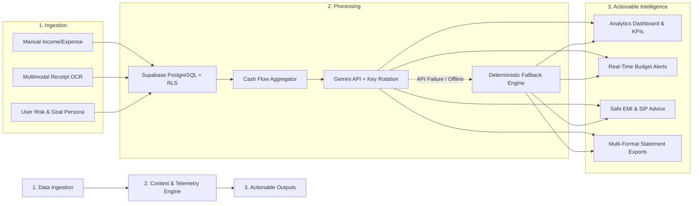

# 🏦 FinMitra — Agentic AI Financial Adviser & Personal Wealth Platform

<p align="center">
  
</p>

<p align="center">
  <strong>Bridging the gap between passive ledger tracking and actionable, context-aware personal wealth advisory.</strong>
</p>

<p align="center">
  <a href="#-the-problem-and-value-proposition"></a>
  <a href="#%EF%B8%8F-tech-stack--architecture"></a>
  <a href="#-agentic-ai-telemetry-engine"></a>
  <a href="#-quick-start-guide"></a>
  <a href="#-contact--hire-me"></a>
</p>

---

## 📌 Table of Contents

- [Overview](#-overview)
- [The Problem & Value Proposition](#-the-problem--value-proposition)
- [How FinMitra Works](#-how-finmitra-works)
- [Key Features](#-key-features)
- [Agentic AI Telemetry Engine](#-agentic-ai-telemetry-engine)
- [System Architecture](#-system-architecture)
- [Tech Stack & Justification](#%EF%B8%8F-tech-stack--justification)
- [Engineering Highlights & Hiring Appeal](#-engineering-highlights--why-this-stands-out)
- [Database Schema & Security (RLS)](#-database-schema--security-rls)
- [Quick Start Guide](#-quick-start-guide)
- [Project Directory Structure](#-project-directory-structure)
- [Future Roadmap](#-future-roadmap)
- [Contact & Hire Me](#-contact--hire-me)

---

## 🌟 Overview

**FinMitra** is a production-grade, full-stack personal finance and wealth management platform built with **React 18**, **Tailwind CSS**, **Supabase (PostgreSQL with Row Level Security)**, and **Google Gemini 2.5 / 3.x Flash**. 

Unlike conventional expense trackers that merely show static charts of where money was lost, FinMitra acts as an **Agentic AI Financial Adviser**. It synthesizes live telemetry from a user's cash flow, category budgets, debt-to-income ratio (DTI), and financial goals to generate mathematically sound, personalized wealth-building recommendations, safe EMI evaluations, and automated receipt OCR logging.

---

## 💡 The Problem & Value Proposition

### The Industry Gaps

Personal finance apps have been around for more than a decade, yet young professionals and retail earners continue to suffer from debt traps, impulse spending, and poor wealth accumulation:

| Pain Point | The Reality in Traditional Apps | How FinMitra Solves It |
| :--- | :--- | :--- |
| **Passive Data vs. Actionable Advice** | Apps show backward-looking static charts ("You spent ₹15,000 on Food") without telling users what to do next. | **Mitra AI** analyzes net savings and generates proactive, step-by-step optimization recommendations. |
| **Financial Blindspots** | Users track numbers across notes and spreadsheets without knowing their real net cash flow or safe spending caps. | Real-time **Net Savings KPI**, **Savings Rate %**, and dynamic budget progress bars keep cash flow transparent. |
| **Risky Loan & EMI Commitments** | Users buy gadgets or take loans on EMIs without knowing if their net cash flow can absorb the commitment. | Built-in **35% Safe EMI Stress-Test Algorithm** checks affordability before you spend. |
| **Generic LLM Hallucinations** | Public AI chatbots lack access to the user's real bank balance, resulting in vague, impractical advice. | **Live Financial Telemetry Injector (RAG)** injects real-time MySQL/PostgreSQL numbers into Gemini prompts. |
| **Friction of Manual Data Entry** | Users abandon budget apps because typing in every receipt and expense is tedious. | **Multimodal Gemini Vision OCR** parses receipt images and auto-populates store name, amount, category, and date in 1 click. |

---

## ⚙️ How FinMitra Works

FinMitra operates as a closed-loop intelligence system consisting of three continuous stages:



1. **Intelligent Ingestion**:
   - The user registers securely via Supabase Auth and completes an **Onboarding Financial Persona Wizard** (Age, Monthly Income, Fixed Costs, Active EMIs, Risk Tolerance, and Retirement Goals).
   - Expenses are added manually or by simply snapping/uploading a receipt image.
2. **Context & Telemetry Synthesis**:
   - When the user asks a question, FinMitra dynamically queries the user's database records to compute in-memory metrics: Total Income, Total Expenses, Net Savings, Top Spending Category, and DTI ratio.
3. **Agentic Advisory & Execution**:
   - The synthesized telemetry is injected into a specialized prompt fed to Google Gemini Flash.
   - If network or API quota limits occur, a **Deterministic Rules-Based Financial Engine** kicks in immediately, ensuring zero downtime.

---

## ✨ Key Features

### 1. 📊 Real-Time Financial Dashboard & Analytics
- **Core Financial Health Metrics**: Live cards for *Total Income*, *Total Expenses*, *Net Savings*, and *Savings Rate (%)*.
- **Interactive Visualizations (Recharts)**:
  - **Category Breakdown**: Dynamic donut chart showing spending distribution (Food, Rent, Utilities, Transport, Shopping, Health, etc.).
  - **Income vs. Expense Trends**: Comparative bar visualizations to track surplus or deficit over time.
  - **Asset Allocation Projection**: Visual representation of recommended equity vs. fixed-income balance.

### 2. 🤖 Agentic AI Financial Adviser ("Mitra AI")
- **Telemetry-Injected Conversations**: Ask questions like *"Can I afford an iPhone on a ₹4,500/month EMI?"* or *"How much should I save for retirement?"* and get answers computed from your actual numbers.
- **Rule of 35% (Safe EMI Threshold)**: Evaluates whether your net monthly savings can comfortably absorb new liabilities without exceeding safe debt ratios.
- **Goal & SIP Planner**: Generates tailored SIP investment amounts at projected CAGR based on your retirement timeline.
- **Zero-Downtime Resilience**: Seamless multi-key rotation across multiple Gemini API keys and automatic fallback to a local deterministic math engine if offline.

### 3. 🧾 Multimodal AI Receipt Scanner (Vision OCR)
- Upload photos or digital bills (PNG, JPG, WebP).
- Powered by **Gemini Vision OCR** to identify:
  - Exact merchant / store name (extracting establishment titles instead of generic "Receipt").
  - Final payable grand total.
  - Appropriate spending category.
  - Transaction date.
- Auto-fills the transaction entry modal for 1-click confirmation, eliminating tedious manual typing.

### 4. 🎯 Goal-Oriented Category Budgeting
- Set monthly spend limits per category (e.g., Food: ₹10,000, Transport: ₹4,000, Entertainment: ₹3,000).
- Live progress bars indicating spent vs. remaining budget.
- Automatic **Over-Budget Warning Badges** when spending breaches threshold limits.

### 5. 📑 Multi-Format Financial Statement Export
- Download comprehensive transaction statements in 4 industry-standard formats:
  - **Excel-Compatible CSV**: Uses UTF-8 Byte Order Mark (`\uFEFF`) to preserve currency symbols (₹) and character formatting in Microsoft Excel and Apple Numbers.
  - **Audit-Grade Formatted PDF**: Clean, printable summary statement with transaction metadata and net balances.
  - **Structured Plain Text (.txt)**: Monospaced ledger summary report.
  - **Raw JSON**: Developer-friendly payload for data backup or custom integration.

### 6. 👤 User Persona & Financial Profiling
- Captures age, occupation, fixed expenses, existing EMIs, risk appetite (*Conservative*, *Moderate*, *Aggressive*), and target retirement age.
- Employs the **100 - Age Asset Allocation Rule** to recommend tailored equity vs. debt splits.

### 7. 🎨 Dual-Theme Design System
- Instant 1-click toggle between:
  - **Dark Obsidian Mode** (`#090B0E`): Sleek, high-contrast, low-eye-strain financial terminal UI.
  - **Warm Cream Day Mode** (`#F5F3EB`): Soft, elegant editorial aesthetic.
- Responsive mobile design with dedicated bottom navigation bar for handheld devices.

---

## 🧠 Agentic AI Telemetry Engine

The primary technical differentiator in FinMitra is its **In-Memory Telemetry Injector** located in [`src/api/aiApi.js`](src/api/aiApi.js).

### How Standard LLMs Fail vs. How FinMitra Succeeds:

```text
Standard LLM Prompt:
"User: Can I buy a ₹80,000 bike on a 12-month EMI?"
LLM Response: "It depends on your income. Make sure you have enough savings!" (GENERIC & USELESS)

FinMitra Telemetry Prompt:
[SYSTEM CONTEXT INJECTED]:
- Monthly Income: ₹65,000
- Fixed Expenses: ₹32,000 | Active EMIs: ₹8,000
- Net Savings: ₹25,000 | Savings Rate: 38.4%
- Highest Spending Category: Rent (₹18,000)
- Risk Profile: Moderate | Age: 26

[USER]: "Can I buy a ₹80,000 bike on a 12-month EMI of ₹7,200?"
FinMitra AI Response:
"✅ YES, you can safely afford this purchase:
1. Your net monthly savings are ₹25,000.
2. A ₹7,200 EMI represents 28.8% of your net savings, safely below our 35% risk threshold.
3. Your remaining surplus will still be ₹17,800/month, leaving ample room for emergency funds."
```

### Deterministic Financial Math Rules Implemented:
1. **Safe EMI Affordability**:
   $$\text{Max Safe EMI} = \text{Net Monthly Savings} \times 0.35$$
2. **50/30/20 Budget Rule**: 50% Needs, 30% Wants, 20% Compounding Wealth Growth.
3. **Asset Allocation (100 - Age Rule)**:
   $$\text{Equity \%} = \max(20, \min(85, 100 - \text{Age})) \quad | \quad \text{Debt \%} = 100 - \text{Equity \%}$$
4. **Retirement Corpus Estimation**:
   $$\text{Corpus Target} = \text{Annual Fixed Expenses} \times 25$$

---

## 🏗️ System Architecture

```text
┌─────────────────────────────────────────────────────────────┐
│                      Client Layer (React 18)                │
│   ├── Context Providers (AuthContext, ThemeContext)         │
│   ├── Interactive Views (Dashboard, Ledger, Budget, AI)     │
│   ├── Recharts Visualization Components                     │
│   └── Multi-Format Client Export Engine (PDF, CSV, TXT)     │
└──────────────┬───────────────────────────────┬──────────────┘
               │                               │
       (Supabase REST / SDK)           (Direct REST / Gemini)
               │                               │
               ▼                               ▼
┌──────────────────────────────┐ ┌─────────────────────────────┐
│    Database & Security Layer │ │   Agentic AI Engine         │
│      (Supabase PostgreSQL)   │ │   (Google Gemini 2.5/3.x)   │
│   ├── Auth & JWT Tokens      │ │   ├── Multi-Key Rotation    │
│   ├── Row Level Security     │ │   ├── Multimodal Vision OCR │
│   ├── 'transactions' Table   │ │   ├── Financial Context RAG │
│   └── 'budgets' Table        │ │   └── Offline Fallback Core │
└──────────────────────────────┘ └─────────────────────────────┘
```

---

## 🛠️ Tech Stack & Justification

| Technology | Category | Why This Was Chosen Over Alternatives |
| :--- | :--- | :--- |
| **React 18** | Frontend Framework | Declarative component model, optimized Virtual DOM batching, and battle-tested ecosystem for financial dashboards. |
| **Vite 5** | Build Tool | Instant Hot Module Replacement (HMR) and optimized Rollup production builds with zero latency. |
| **Tailwind CSS** | Styling System | Utility-first architecture allowing precise tokens for Dark Obsidian and Warm Cream themes without CSS bloat. |
| **Supabase (PostgreSQL)** | Database & Auth | Enterprise-grade PostgreSQL with **Row Level Security (RLS)** ensuring tenant isolation, coupled with secure JWT authentication. |
| **Google Gemini Flash** | Generative AI | High-speed, cost-effective multimodal LLM with low latency and native support for vision (OCR receipt parsing). |
| **Recharts** | Data Visualization | Declarative SVG charting library with responsive container wrappers tailored for clean financial cards. |
| **Lucide React** | Iconography | Lightweight, consistent, modern icons with zero runtime footprint. |

---

## 🚀 Engineering Highlights (Why This Stands Out)

If you are a recruiter or technical interviewer, here are several engineering decisions that showcase real-world development rigor:

1. **Resilience Engineering & Multi-Key Failover**:
   - The Gemini API handler in [`src/api/aiApi.js`](src/api/aiApi.js) supports automatic rotation across multiple API keys (`VITE_GEMINI_API_KEY_1`, `2`, etc.) and iterates through fallback model tiers (`gemini-3.6-flash`, `gemini-3.8-flash`, `gemini-flash-latest`) upon encountering HTTP 429 (rate limits).
   - If all external API calls fail or the client is offline, a deterministic offline rules engine guarantees **100% response uptime**.

2. **Row Level Security (RLS) & Multi-Tenant Privacy**:
   - Rather than relying solely on frontend filtering, the database enforces PostgreSQL policies at the engine level: `auth.uid() = user_id`. No user can ever query or tamper with another user's financial records.

3. **Client-Side Export with Character Encoding (BOM)**:
   - CSV export utilities prepend the UTF-8 Byte Order Mark (`\uFEFF`), resolving a common industry bug where Excel corrupts non-ASCII symbols like Indian Rupee (`₹`).

4. **Zero-Friction Multimodal Vision OCR**:
   - Employs strict JSON prompt schemas on Gemini Vision to isolate establishment names, totals, and categories directly from noisy receipt photos.

5. **Pure Stateless Architecture with Offline Capabilities**:
   - User profile configurations synchronize seamlessly between local persistence and runtime state, ensuring instant page reloads and smooth onboarding.

---

## 🗄️ Database Schema & Security (RLS)

If setting up your own Supabase instance, run this SQL in your **Supabase SQL Editor**:

```sql
-- 1. Create Transactions Table
create table public.transactions (
    id uuid default gen_random_uuid() primary key,
    user_id uuid references auth.users(id) on delete cascade not null,
    amount numeric(12, 2) not null,
    category text not null,
    note text default 'Expense',
    type text check (type in ('INCOME', 'EXPENSE')) not null,
    date date default current_date not null,
    created_at timestamp with time zone default now() not null
);

-- 2. Create Budgets Table
create table public.budgets (
    id uuid default gen_random_uuid() primary key,
    user_id uuid references auth.users(id) on delete cascade not null,
    category text not null,
    limit_amount numeric(12, 2) not null,
    created_at timestamp with time zone default now() not null,
    unique(user_id, category)
);

-- 3. Enable Row Level Security (RLS)
alter table public.transactions enable row level security;
alter table public.budgets enable row level security;

-- 4. Apply Strict Multi-Tenant Isolation Policies
create policy "Users can only read their own transactions"
    on public.transactions for select
    using (auth.uid() = user_id);

create policy "Users can insert their own transactions"
    on public.transactions for insert
    with check (auth.uid() = user_id);

create policy "Users can update their own transactions"
    on public.transactions for update
    using (auth.uid() = user_id);

create policy "Users can delete their own transactions"
    on public.transactions for delete
    using (auth.uid() = user_id);

create policy "Users can manage their own budgets"
    on public.budgets for all
    using (auth.uid() = user_id);
```

---

## ⚡ Quick Start Guide

### Prerequisites
- **Node.js**: v18.0.0 or higher
- **npm** or **yarn** / **pnpm**
- A free [Supabase](https://supabase.com) project
- A free [Google Gemini API Key](https://aistudio.google.com/)

### 1. Clone the Repository
```bash
git clone https://github.com/your-username/finmitra.git
cd finmitra
```

### 2. Install Dependencies
```bash
npm install
```

### 3. Configure Environment Variables
Copy `.env.example` to `.env`:
```bash
cp .env.example .env
```
Fill in your credentials in `.env`:
```env
VITE_SUPABASE_URL="https://your-project.supabase.co"
VITE_SUPABASE_ANON_KEY="your-supabase-anon-key"
VITE_GEMINI_API_KEY="your-gemini-api-key"
```

### 4. Run Locally
```bash
npm run dev
```
Open **`http://localhost:3000`** in your browser.

---

## 📁 Project Directory Structure

```text
finmitra/
├── .env.example                  # Sanitized environment variable template
├── index.html                    # Single Page App HTML entry point
├── package.json                  # Dependencies (React, Recharts, Gemini, Supabase)
├── tailwind.config.js            # Custom design tokens & theme colors
├── vite.config.js                # Vite build and dev server config
│
├── public/                       # Static public assets, favicon, and brand logo
│   ├── logo.png
│   └── logo-transparent.png
│
└── src/
    ├── main.jsx                  # React DOM initialization
    ├── App.jsx                   # Theme and Auth context root
    ├── index.css                 # Global CSS rules, typography, and palette variables
    ├── supabaseClient.js         # Supabase connection & validation singleton
    │
    ├── context/
    │   ├── AuthContext.jsx       # Supabase session provider & auth state
    │   └── ThemeContext.jsx      # Dark Obsidian / Soft Cream theme toggle
    │
    ├── api/
    │   ├── aiApi.js              # Gemini API caller, key rotation & telemetry RAG
    │   ├── authApi.js            # Supabase auth wrapper (login, signup, session)
    │   ├── budgetApi.js          # Budget limits & category spend calculations
    │   ├── profileApi.js         # User financial persona, age & goal manager
    │   └── transactionApi.js     # Transaction CRUD operations
    │
    ├── components/
    │   ├── auth/                 # Sign-in & Sign-up modal card with validation
    │   ├── chat/                 # Floating AI adviser chat widget
    │   ├── common/               # Multi-format statement export dropdown
    │   ├── dashboard/            # Dashboard KPI cards, Recharts, Top Assets
    │   ├── layout/               # Desktop Sidebar, Header, Mobile BottomNav
    │   └── onboarding/           # First-time user financial profiling wizard
    │
    ├── utils/
    │   └── exportUtils.js        # CSV (BOM-encoded), PDF, TXT, and JSON exporters
    │
    └── views/
        ├── DashboardView.jsx     # Main financial analytics view
        ├── TransactionsView.jsx  # Expense/Income ledger table & modals
        ├── BudgetView.jsx        # Category spending caps & alert indicators
        ├── AIInsightView.jsx     # Dedicated Mitra AI strategy hub
        └── ProfileView.jsx       # User persona, debt ratios & retirement settings
```

---

## 🗺️ Future Roadmap

- [ ] **Account Aggregator (AA) Integration**: Automatic bank transaction syncing via RBI-regulated Account Aggregator APIs.
- [ ] **Bank SMS Auto-Parser**: Automatic expense categorization from mobile transaction notifications.
- [ ] **Goal-Based Savings Vaults**: Virtual lockboxes for emergency funds, vacations, or home down-payments with compounding trackers.
- [ ] **Regional Language Localization**: Multilingual voice & text assistance (Hindi, Tamil, Telugu, Marathi).
- [ ] **Native Mobile App**: Cross-platform deployment via React Native with real-time push alerts for budget limit breaches.

---

## 👨‍💻 Contact & Hire Me

I am a passionate software engineer focused on building high-impact, full-stack applications with modern web technologies and real-world AI integrations.

- **Developer**: Tushar ([iyumtush](https://github.com/iyumtush))
- **Role Open To**: Full-Stack Engineer / Frontend Engineer / AI Application Developer
- **Let's Connect**:
  - **GitHub**: [@iyumtush](https://github.com/iyumtush)
  - **Email**: Reach out directly via GitHub profile
  - **LinkedIn**: [Connect on LinkedIn](https://linkedin.com)

---

<p align="center">
  <sub>Built with ❤️ using React, Tailwind CSS, Supabase, and Google Gemini.</sub><br>
  <sub>⭐ If you find this project insightful, consider starring the repository!</sub>
</p>
